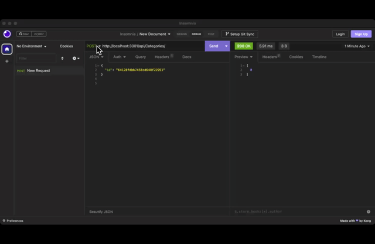
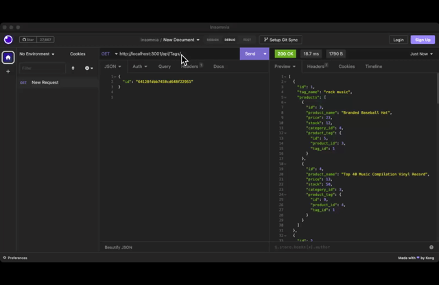

# E-commerce

#  Description
Ecommerce-backend is a back-end web application that utilizes Express.js and Sequelize ORM to create a RESTful API for managing products, categories, and tags in an e-commerce store. The application stores data in a MySQL database, making it easy to manage and retrieve information efficiently.

# Useage
Check out the walkthrough video to get a detailed look at the functionality of the application. 

